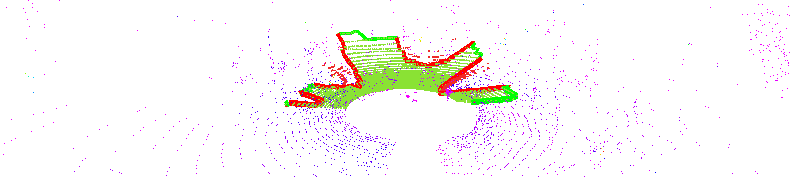

# LIDAR FILTER

# Hardverkörnyezet
- Intel Core i-12700H 2.30 GHz (a viruális környezet 7 magot használ)
- 16 GB memória
- 60 GB SSD tárhely
- Nvidia GeeForce RTX 3070 videókártya

# Szoftverkörnyezet
- Ubuntu 18.04
- Robot Operating System Melodic
- Visual Studio Code 1.75.1
- Terminator 1.91

# Sample rosbag
https://laesze-my.sharepoint.com/:u:/g/personal/herno_o365_sze_hu/EYl_ahy5pgBBhNHt5ZkiBikBoy_j_x95E96rDtTsxueB_A?download=1 -O leaf-2021-04-23-campus.bag

# Launch indítás
roslaunch lidar_filter filter.launch

# Képek
az images könyvtárban találhatóak

# Dokumentáció
a doc könyvtárban található
